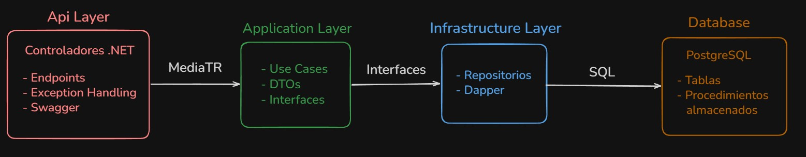

# Descripción General

El backend está construido usando .NET siguiendo una arquitectura en capas, con separación clara de responsabilidades:

- API Layer (Presentation)
- Application Layer
- Infrastructure Layer
- Database (PostgreSQL)

Se implementa un enfoque Clean Architecture, donde las dependencias siempre apuntan hacia el dominio.

## Descripción por capas

### API Layer (Presentation)

Responsable de manejar las solicitudes HTTP.

Tecnologías:

- ASP.NET Core
- Swagger
- Middleware (ExceptionHandler, CORS)

Responsabilidades:

- Exponer endpoints REST (/tasks)
- Manejar errores globales
- Serializar respuestas (camelCase)
- Configurar CORS

### Application Layer

Contiene la lógica de negocio (sin depender de infraestructura).

Tecnologías:

- MediatR

Responsabilidades:

- Casos de uso (ej: GetTasks, GetTaskById)
- Validaciones
- Definición de interfaces (ITaskRepository)
- Modelos de respuesta (ResponseApp<T>)

### Infrastructure Layer

Implementa el acceso a datos.

Tecnologías:

- Dapper

Responsabilidades:

- Implementación de repositorios
- Ejecución de queries / stored procedures
- Conexión a PostgreSQL

### Database Layer

Tecnologías:

- PostgreSQL

Componentes:

Tablas:

- Task
  - Priority
  - Status
- Funciones:
  - SP_Task_GetAll
  - SP_Task_GetById

Responsabilidades:

Persistencia de datos
Lógica SQL (joins, filtros)

### Flujo de una petición

Ejemplo: GET /tasks

1. Cliente (React Native)
2. → HTTP Request (/tasks)
3. → Controller (API Layer)
4. → MediatR Handler (Application)
5. → ITaskRepository
6. → TaskRepository (Infrastructure)
7. → PostgreSQL (SP_Task_GetAll)
8. → Respuesta hacia arriba
9. → JSON al cliente

## Diagrama

