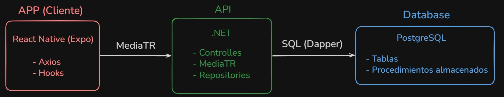

# Descripción General

El sistema sigue un modelo de comunicación cliente-servidor dividido en tres componentes principales:

Aplicación móvil (React Native / Expo)
API Backend (ASP.NET Core)
Base de datos (PostgreSQL)

La comunicación se realiza mediante:

HTTP/REST entre App y API
SQL (Dapper) entre API y Base de Datos

## Flujo de comunicación:

1. App (React Native)
   → Ejecuta hook (useLoadTasks)
   → Llama a Axios

2. Axios
   → HTTP GET /tasks

3. API (Controller)
   → Recibe request
   → Envía a MediatR

4. Application Layer
   → Ejecuta caso de uso

5. Repository (Infrastructure)
   → Ejecuta SP_Task_GetAll

6. PostgreSQL
   → Retorna datos

7. API
   → Construye ResponseApp<T>
   → Devuelve JSON

8. App
   → Adapter transforma datos
   → Store (Zustand)
   → UI renderiza

## Ejemplo de request / response

### Request (App → API)

```JSON
GET /tasks?statusId=1&priorityId=2
```

### Response (API → App)

```JSON
{
  "statusCode": 200,
  "message": "OK",
  "data": [
    {
      "taskId": 1,
      "title": "Implementar login",
      "description": "Se debe implementar el login para...",
      "priorityId": 2,
      "priorityName": "Media",
      "statusId": 1,
      "statusName": "Pendiente",
    }
  ]
}
```

### Transformación de datos

La app no usa directamente la respuesta del backend. Se da el siguiente flujo:

```
API Response → Adapter → Entity (Task) → Store → UI
```

```ts
priorityId: 1 → "high"
statusId: 1 → "pending"
```

## Diagrama


